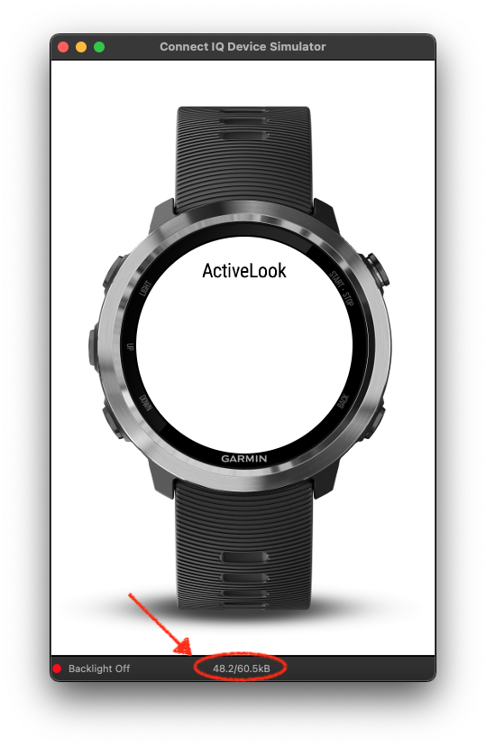

# ActiveLookDataField

Enables a [compatible Garmin device](#compatible-devices) running Connect IQ to display live workout metrics (and some more!) in the ActiveLook glasses.

The "ActiveLook Datafield" is an advanced plugin that installs directly on your [compatible Garmin device](#compatible-devices) and automatically connects to your ActiveLook eyewear.

# Installation

The following is a quick summary of the official [Getting Started](https://developer.garmin.com/connect-iq/connect-iq-basics/getting-started/) tutorial.

To install the project on your machine, you need to have [Visual Studio Code](https://code.visualstudio.com/docs/setup/setup-overview) installed.

## SDK Manager

Download and install the [SDK Manager](https://developer.garmin.com/connect-iq/sdk/).

## SDK

Once the SDK manager is installed, download a version of the SDK to link your project against.
At the time of this writing (2024/04/18), the version used to develop is `6.3.1`.

## Monkey C Visual Studio Code Extension

Install the [Visual Studio Code extension](https://developer.garmin.com/connect-iq/reference-guides/visual-studio-code-extension/).

## Devices

Next, download [compatible Garmin device](#compatible-devices) to run the project on.

# How to use

Once the environment is set up correctly, run the [run.sh](run.sh) script with the `run` command:
> $ ./run.sh run

To run on a [compatible Garmin device](#compatible-devices), eg fenix7 one:
> $ ./run.sh --device fenix7 run

The `help` command will list the available commands.
> $ ./run.sh help
  ```
  help     Display this help message
  build    Build the datafield for a device
  simu     Start the simulator
  run      Run in the simulator
  debug    Debug with the simulator
  clean    Remove bin directory - useful if the simulator is unresponsive
  doc      Generate documentation - in `/bin/doc/`
  pack     Build the datafield as a Connect IQ package
  ```

See `Description > run.sh` for more informations.

Another method to run the project is explained in [Your First Connect IQ App](https://developer.garmin.com/connect-iq/connect-iq-basics/your-first-app/), but is less convenient than using the script.

# **_CRITICAL NOTE!_**
**Connect IQ devices are embedded systems with limited memory. Almost every byte counts!**

>Keep that in mind whenever coding for the platform!.

The memory used and the one available are displayed dynamically in the simulator's status bar and is dependant on the device run.


At the time of this [edit 1](#EDIT1), the `fenix7` device is the compatible device with the least available memory.

# Description

> Dynamic data fields allow customers and third party developers to write additional metrics and data that will display with Garmin activities. The goal is to create a system that not only makes it easy for a user to make a quick data field based off our workout data, but also gives the developer the the ability to customize the presentation. [ConnectIQ - Datafields](https://developer.garmin.com/connect-iq/connect-iq-basics/app-types/#datafields)

It is written in [Monkey C](https://developer.garmin.com/connect-iq/reference-guides/monkey-c-reference/), an interpreted, object-oriented, dynamic language.
It has a lot of useful features, like:
  - [Type introspection](https://en.wikipedia.org/wiki/Type_introspection) and [duck typing](https://en.wikipedia.org/wiki/Duck_typing): no primitive types, runtime loading, ...
  - reference counting: the virtual machine cleans the memory as needed (see `Weak References` in [Monkey C](https://developer.garmin.com/connect-iq/reference-guides/monkey-c-reference/))

The datafield is available on the ConnectIQ Store : [ActiveLook - Data Field for sport smart glasses](https://apps.garmin.com/en-US/apps/af8e8b58-3485-425b-b75b-5e412c2d1dfe).

## Composition

The project is composed of the following files:

  - `Assets` folder:
    Contains all the assets (images, fonts) used for the project, as well as scripts to generate said assets (work in progress - no documentation yet).

  - `bin` folder:
    Generated folder and content

  - `ressources` folder:
    - `settings` folder:
      - `properties.xml`:
        - `glasses_name`: the name of the glasses
        - `screens`: Defines the screen quadrant available to display the datafield in, by default
        - `run`: Defines the screen quadrant available to display the datafield in, for the run activity
        - `bike`: Defines the screen quadrant available to display the datafield in, for the bike activity
        - `is_auto_loop`: Enable or disabled Auto loop on data sreens
        - `loop_timer`: Defines the timer in second between each swipe

          Depending on the activity choosen, the user will be able to display different screens presenting differents metrics  (none, 1 or more as available).
          The datafield offers preset screens, listed in the property string.

          For examples the string:
          ```xml 
          <property id="run" type="string">(1,2,4)(1,2,12)(10,18,15)(0)</property>
          ```
          states that when the user selects the `run` activity, the preset choices displays are:
            - `(1,2,4)`: Chrono & Distance & Heart rate, on page 1
            - `(1,2,12)`: Chrono & Distance & Speed, on page 2
            - `(10,18,15)`: Power 3s & Cadence & Pace, on page 3
            - `(0)`: page 4 to turn the screen off

          The following table lists the available metrics:
          | id |               Name               | Metric | Full-imp | Half | Metric   -  Imperial |
          |:--:|:--------------------------------:|:------:|:--------:|:----:|:--------------------:|
          | 0  | Empty page                       | 100    |          |      |                      |
          | 1  | Chrono                           | 11     |          | 43   |                      |
          | 2  | Distance                         | 12     | 35       | 46   |        km - mi       |
          | 3  | Distance To Destination          | 101    | 102      | 103  |        km - mi       |
          | 4  | Heart Rate                       | 21     |          | 49   |          bpm         |
          | 5  | Max HeartRate                    | 29     |          | 61   |          bpm         |
          | 6  | Average Heart Rate               | 24     |          | 52   |          bpm         |
          | 7  | Power                            | 22     |          | 56   |           w          |
          | 8  | Max Power                        | 30     |          | 62   |           w          |
          | 9  | Average Power                    | 25     |          | 53   |           w          |
          | 10 | Power 3s                         | 42     |          | 65   |           w          |
          | 11 | Power Normalized                 | 69     |          | 70   |           w          |
          | 12 | Speed                            | 13     | 33       | 44   |      km/h - mph      |
          | 13 | Max Speed                        | 31     | 41       | 63   |      km/h - mph      |
          | 14 | Average Speed                    | 14     | 34       | 45   |      km/h - mph      |
          | 15 | Pace                             | 15     | 37       | 48   |    min/km - min/mi   |
          | 16 | Fastest Pace                     | 104    | 105      | 106  |    min/km - min/mi   |
          | 17 | Average Pace                     | 66     | 67       | 68   |    min/km - min/mi   |
          | 18 | Cadence                          | 16     |          | 55   |rpm (bike) - spm (run)|
          | 19 | Max Cadence                      | 28     |          | 60   |rpm (bike) - spm (run)|
          | 20 | Average Cadence                  | 23     |          | 51   |rpm (bike) - spm (run)|
          | 21 | Altitude                         | 18     | 38       | 50   |         m - ft       |
          | 22 | Total Ascent                     | 19     | 36       | 47   |         m - ft       |
          | 23 | Total Descent                    | 26     | 39       | 57   |         m - ft       |
          | 24 | Average  Ascent Speed            | 20     | 40       | 59   |       m/h - ft/h     |
          | 25 | Total Calories                   | 17     |          | 54   |          kCal        |
          | 26 | Energy Expenditure               | 27     |          | 58   |        Kcal/min      |
          | 27 | Ground Contact Time              | 189    |          | 190  |           ms         |
          | 28 | Average Ground Contact Time      | 189    |          | 190  |           ms         |
          | 29 | Vertical Oscillation             | 200    | 201      | 202  |         m - ft       |
          | 30 | Average Vertical Oscillation     | 200    | 201      | 202  |         m - ft       |
          | 31 | Step Length                      | 194    | 195      | 196  |        cm - in       |
          | 32 | Average Step Length              | 194    | 195      | 196  |        cm - in       |
          | 33 | Lap Chrono                       | 11     |          | 43   |                      |
          | 34 | Lap Elapsed Distance             | 12     | 35       | 46   |        km - mi       |
          | 35 | Lap Average Heart Rate           | 24     |          | 52   |          bpm         |
          | 36 | Lap Average Power                | 25     |          | 53   |           w          |
          | 37 | Lap Average Speed                | 14     | 34       | 45   |      km/h - mph      |
          | 38 | Lap Average Pace                 | 66     | 67       | 68   |    min/km - min/mi   |
          | 39 | Lap Average Cadence              | 23     |          | 53   |rpm (bike) - spm (run)|
          | 40 | Lap Total Ascent                 | 19     | 36       | 47   |         m - ft       |
          | 41 | Lap Total Descent                | 26     | 39       | 57   |         m - ft       |
          | 42 | Lap Average Ascent Speed         | 20     | 40       | 59   |       m/h - ft/h     |
          | 43 | Lap Calories                     | 17     |          | 54   |          kCal        |
          | 44 | Lap Average Ground Contact Time  | 189    |          | 190  |           ms         |
          | 45 | Lap Average Vertical Oscillation | 200    | 201      | 202  |         m - ft       |
          | 46 | Lap Average Step Length          | 194    | 195      | 196  |        cm - in       |

          For more informations about the screens, see [Configure your data screens](https://help.activelook.net/en/articles/5290907-activelook-garmin#h_cdce7cb4b9).

      - `settings.xml`:\
        Defines the settings that are editable using the `Garmin Connect` app.
        In the simulator, these properties can be accessed and modified using the `File > Edit persistant storage > ...` menu items.
    - `strings` folder:\
      Localization file.

  - `scripts` folder:\
    (work in progress - no documentation yet)

  - `source` folder:
    - `ActiveLook.mc`\
      Defines the `ActiveLookBLE` module which handles the BLE communications. It is used by `ActiveLooSDK_next.mc`

    - `ActiveLookActivityInfo.mc`\
      Defines the modules `AugmentedActivityInfo`, `PageSettings`, and `Layouts`, all in the namespace `ActiveLook`.

      - `AugmentedActivityInfo` computes extra metrics from the `ActivityInfo` provided by ConnectIQ:
        - `currentPace`
        - `fastestPace`
        - `averagePace`
        - `threeSecPower`
        - `normalizedPower`
        - `averageAscentSpeed`
        - --> These metrics are used in the datafield.
      - `PageSettings` is used to arrange the differents layouts on a given page of the datafield.
      - `Layouts` is in charge of formatting the data to best suit the type of data the given layout is displaying, together with the space available for said layout.
      
      This file is the one that is the most frequently modified, to support new devices, positions, layouts, etc...

    - `ActiveLookDataFieldApp.mc`\
      Stub generated automatically

    - `ActiveLookDataFieldView.m`\
      It is the main entrypoint to the datafield.

      It defines, among other things, the `ActiveLookDataFieldView` class.

      The Connect IQ OS calls the `compute(info)` function every second (give and take a few milliseconds...).
      The `info` parameters, of type `ActivityInfo`, holds the metrics provided by the Garmin device.

      > If the device has connected sensor(s) (e.g. a heart rate sensor), then it will send the corresponding metric (in this case, the Heart Rate metric) thru the `ActivityInfo` object.

      It holds the global variables, defines the drawing of the datafield, its updates, and its life-cycle.

      It calls the `ActiveLookSDK_next.mc` to execute commands on the glasses.
      See `Description > Sources > ActiveLookSDK_next.mc` for more details about the different commands

    - `ActiveLookSDK_next.mc`\
      It defines the `ActiveLookSDK` module. It is a basic version of the Android and iOS SDKs. 
      It allows the datafield to interact with the ActiveLook Glasses' Firmware using the [ActiveLook® Programming Interface](https://github.com/ActiveLook/Activelook-API-Documentation/blob/main/ActiveLook_API.md)
      Its only purpose it to format the commands and payload correcty.

      A list of all the [command indexes](https://github.com/ActiveLook/Activelook-API-Documentation/blob/main/ActiveLook_API.md#4-activelook-commands)

  - `.project`\
    generated file – Eclipse's remainder.

  - `barrel.jungle`\
    generated file

  - `GarminDeveloperKey`\
    **VERY SENSITIVE FILE!**

    Included in the repo for convenience. 
    This key is used to push the datafield on the Garmin store, updates, etc... 
   
    **DO NOT LOSE, NOR SHARE, NOR TEMPER WITH!**
 
  - `manifest.xml`\
    defines the minimum sdk, required capabilities, langages, and devices compatible with the project.
 
  - `monkey.jungle`\
    generated file

  - `README.md`\
    this file

  - `run.sh`\
    A script used to launch the project on one of the [compatible Garmin device](#compatible-devices) defined in the [manifest.xml file](manifest.xml).
    - to run on the simulator of an edge1030
      > ./run.sh --device edge1030 run

    - to debug on the simulator of an edge1030
      > ./run.sh --device edge1030 debug

    If the simulator becomes unresponsive, or it is not possible to launch the project
    > ./run.sh clean

# Assets generation

Generate `devices.csv` :

```sh
cd assets
./generate-all.sh
```

Generate graphicals assets :

```sh
./generate.sh
```

# BLE on simulator

You can use a [nrf52840 dongle](https://www.nordicsemi.com/Products/Development-hardware/nrf52840-dongle) to connect Glasses with simulator.

1. Download and install [NRF Connect for destktop](https://www.nordicsemi.com/Products/Development-tools/nrf-connect-for-desktop)
1. Use the programmer tool to configure your dongle by installing the [BLE-nRF52840-dongle.hex](README_assets/BLE-nRF52840-dongle.hex)
2. To find your Nordic Port Com
   ```sh
   ls /dev/tty*  
   ``` 
3. In the Garmin simulator, these Nordic Port Comm can be added using the `Settings > BLE Settings >` menu items.

# Get logs from physical devices

1. Connect your physical device to you PC or Mac 
2. On Mac you have to install [Android File Transfert](https://support.google.com/android/answer/9064445?hl=en#zippy=)
3. Add empty text file  `/GARMIN/APPS/LOGS/ActiveLookApp.TXT`

# History (YYYY/MM/DD)

0. <a id="EDIT0">2022/08/05</a> Document creation.
1. <a id="EDIT1">2023/04/24</a> Update metrics available & devices compatibility
2. <a id="EDIT2">2023/09/28</a> Update assets generation, BLE on simulator & devices compatibility
3. <a id="EDIT2">2024/06/06</a> How to get logs on physical device

<!-- # Footnotes -->
## Compatible devices

The compatible devices are listed in the file [manifest.xml](manifest.xml)\
At the time of this [edit 1](#EDIT2) they are:

- approachs7042mm
- approachs7047mm
- d2airx10
- d2mach1
- descentmk2
- descentmk2s
- edge1030
- edge1030plus
- edge1040
- edge530
- edge540
- edge830
- edge840
- edgeexplore
- edgeexplore2
- epix2
- epix2pro42mm
- epix2pro47mm
- epix2pro51mm
- fenix5plus
- fenix5splus
- fenix5xplus
- fenix6pro
- fenix6spro
- fenix6xpro
- fenix7
- fenix7pro
- fenix7s
- fenix7spro
- fenix7x
- fenix7xpro
- fr165m
- fr165
- fr245m
- fr255
- fr255m
- fr255s
- fr255sm
- fr265
- fr265s
- fr745
- fr945
- fr945lte
- fr955
- fr965
- marq2
- marq2aviator
- marqadventurer
- marqathlete
- marqaviator
- marqcaptain
- marqcommander
- marqdriver
- marqexpedition
- marqgolfer
- venu2
- venu2plus
- venu2s
- venu3
- venu3s
- venusq2m
- vivoactive5
